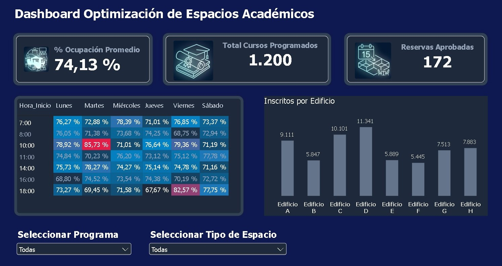
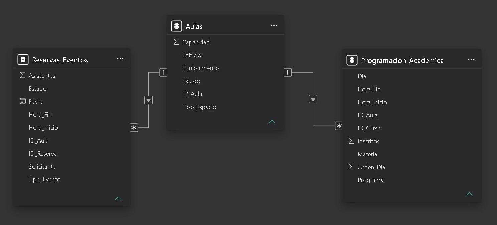

# 🏛️ Dashboard de Optimización de Espacios Académicos 



## 📌 Descripción del Proyecto
Este proyecto consiste en un tablero de control ejecutivo desarrollado en **Power BI** para la gestión estratégica y optimización de espacios físicos en un campus universitario. 

Permite monitorear indicadores clave como la tasa de ocupación por horarios, la distribución de inscritos por edificio y el cumplimiento de reservas aprobadas, facilitando la toma de decisiones basada en datos para el área de programación académica.

---

## 🛠️ Tecnologías y Herramientas Utilizadas
- **Business Intelligence:** Power BI Desktop (Power Query, DAX, Dark Mode UI).
- **Procesamiento de Datos:** Python (Pandas / NumPy) para la generación y limpieza de datasets.
- **Origen de Datos:** Microsoft Excel (`Base_Datos_Programacion_Academica.xlsx`)[cite: 13].
- **Diseño & UI:** Figma / Power BI Custom Themes (Paleta ejecutiva Dark Mode `#0B111E`).

---

## 📐 Modelo de Datos y Arquitectura
El modelo sigue una arquitectura de **Esquema en Estrella (Star Schema)** optimizada para garantizar un alto rendimiento en las consultas y evitar dependencias circulares.



### Componentes Clave del Modelado:
- **Tabla de Hechos (Fact Table):** `Reservas_Cursos` (almacena el detalle de programaciones, espacios y matrículas).
- **Tablas de Dimensión (Dimension Tables):** `Dim_Edificio`, `Dim_Programa`, `Dim_Dia` y `Dim_Hora`.
- **Estrategia DAX / Helper Columns:** Implementación de la columna auxiliar `Orden_Dia` para asegurar el ordenamiento cronológico correcto de la matriz semanal (Lunes a Sábado) sin interferir en el flujo de filtrado dinámico.
- **Relaciones:** Relaciones unidireccionales de `1 a Muchos (1:*)` manteniendo la integridad referencial.

---

## 📊 Principales KPIs y Métricas Implementadas
1. **% Ocupación Promedio:** Medida DAX para evaluar el porcentaje de uso efectivo de aulas según la capacidad instalada.
2. **Total Cursos Programados:** Conteo de materias y secciones asignadas activas.
3. **Reservas Aprobadas:** Métrica de solicitudes confirmadas para eventos o clases extemporáneas.
4. **Matriz de Ocupación por Horario (Heatmap):** Visualización interactiva para detectar picos y valles de uso de salón por día de la semana y hora de inicio.
5. **Inscritos por Edificio:** Gráfico de barras ordenado secuencialmente con separadores de miles para análisis de carga por bloque académico.

---

## 🗂️ Estructura del Repositorio

```text
proyecto-optimizacion-espacios-academicos/
├── dashboard/
│   ├── Reporte_Optimizacion_Aulas.pbix  # Archivo ejecutable de Power BI
│   └── img/                             # Iconos e imágenes para tarjetas KPI
├── data/
│   └── raw/
│       └── Base_Datos_Programacion_Academica.xlsx  # Dataset de origen
├── docs/
│   ├── dashboard_preview.jpg            # Captura de alta resolución del reporte
│   └── data_model_diagram.jpg           # Diagrama ER del modelo relacional
└── src/
    └── generador_datos.py               # Script Python para simulación/ETL de datos